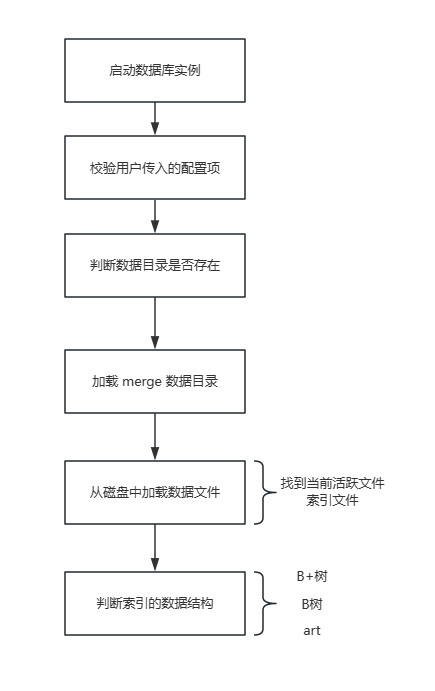

# bitcask启动流程

## 简易流程

## 详细流程

启动流程

1.  校验用户传入的配置项

    *   校验地址
    *   校验文件大小
    *   校验文件合并位点
2.  判断数据目录是否存在，如果不存在的话，则创建目录
3.  判断当前数据目录是否正在使用（使用文件锁保证数据库只有一个进程在使用）
4.  初始化 DB 实例结构体
5.  加载 merge 数据目录

    *   merge 目录不存在的话，直接返回
    *   查找标记 merge 完成的文件，判断 merge 是否完成
        *   没有 merge 完成则直接返回
        *   有merge，获取最后一次执行merge的文件
    *   删除旧的数据文件
    *   将新的数据文件移动到数据目录中
6.  从磁盘中加载数据文件（索引文件）
    *   遍历目录中的所有文件，找到所有以 .data 结尾的文件
    *   对文件 id 进行排序，从小到大依次加载（id是最大的，说明是当前活跃文件，其他文件作为历史文件）
7.  判断索引的数据结构（B+树的索引存在磁盘上，非B+树索引放到内存中）

    *   B+树

        *   取出当前事务序列号（方便之后的使用）
        *   更新活跃文件的 WriteOff
    *   非B+树

        *   &#x20;从 hint 索引文件中加载索引
        *   &#x20;从数据文件中加载索引，遍历文件中的所有记录，并更新到内存索引中

            *   没有文件，说明数据库是空的，直接返回
            *   查看是否发生过 merge（文件id比最近参与过merge的文件id更新，则说明已经从 hint文件中加载过了）
            *   遍历所有的文件id，处理文件中的记录

                *   对比最近未参与 merge 的文件 id
                *   构造内存索引对象，拿到数据事务序列号（这里要注意同一个事务的数据记录跨了两个文件，先将未完成的事务保存后，再获取下一个数据文件后读取到事务完成标志再更新内存）

                    *   若不是事务则直接更新到内存
                    *   若事务已完成则更新到内存
            *   如果是当前活跃文件，更新文件的 WriteOff
        *   &#x20;重置 IO 类型为标准文件 IO（使用Mmap做只读启动加速，完成后更改回标志IO，可作为优化点，直接在Mmap写）

