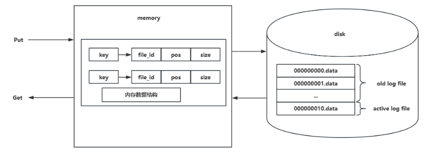

# 内存磁盘设计

## 内存设计

内存索引的设计，需要支持高效插入、读取、删除数据的结构，并且如果需要数据高效遍历的话，则最好选择支持有序的结构。

常见的内存索引数据结构如下

1、BTree（主要封装了 google 开源的项目：[https://github.com/google/btree](https://github.com/google/btree，调用)）

2、ART（主要封装了 https://github.com/plar/go-adaptive-radix-tree 库）

3、跳表

为了后续支持扩展，定义了通用的接口

```
type Indexer interface {
	// Put 向索引中存储 key 对应的数据位置信息
	Put(key []byte, pos *data.LogRecordPos) *data.LogRecordPos

	// Get 根据 key 取出的索引位置信息
	Get(key []byte) *data.LogRecordPos

	// Delete 根据 key 删除的索引位置信息
	Delete(key []byte) (*data.LogRecordPos, bool)

	// Size 索引中的数据量
	Size() int

	// Iterator 索引迭代器
	Iterator(reverse bool) Iterator

	// Close 关闭索引
	Close() error
}
```

## 磁盘设计

磁盘目前只支持标准读写和Mmap进行数据库启动加速，为了之后可能支持更多种读写形式设计通用的结构

```
// IOManager 通用 IO 管理接口，可以接入不同的 IO 类型
type IOManager interface {
	// Read 从文件的给定位置读取对应的数据
	Read([]byte, int64) (int, error)

	// Write 写入字节数组到文件中
	Write([]byte) (int, error)

	// Sync 持久化数据
	Sync() error

	// Close 关闭文件
	Close() error

	// Size 获取到文件大小
	Size() (int64, error)
}
```

## 存储引擎架构

存储引擎架构大致如下

