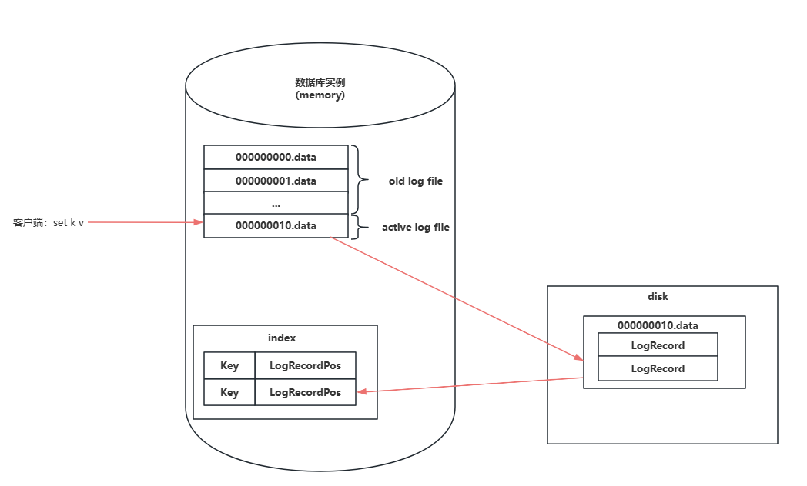
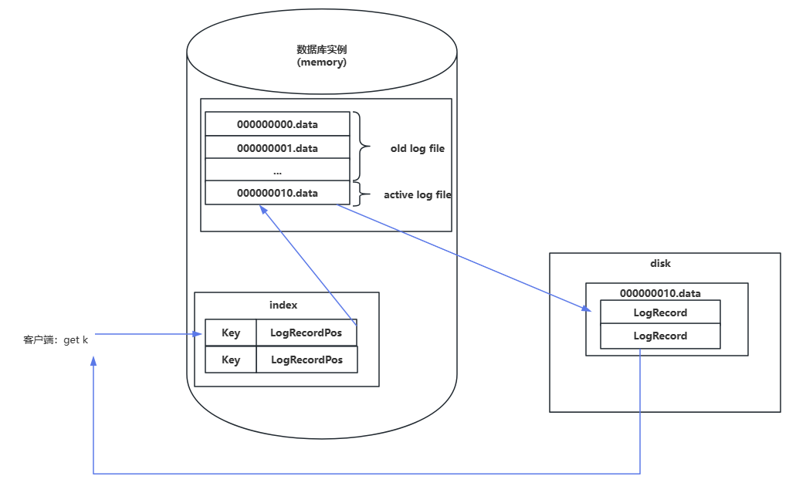

# 数据读写流程

## 写数据流程

简略图大致如下

写数据流程总体
1、将新数据写入磁盘中
2、更新内存

    // Put 写入 key/value key不为空
    func (db *DB) Put(key []byte, value []byte) error {
    	// 判断 key 是否有效
    	if len(key) == 0 {
    		return ErrKeyIsEmpty
    	}
    
    	// 构造 LogRecord 结构体
    	logRecord := &data.LogRecord{
    		Key:   logRecordKeyWithSeq(key, nonTransactionSeqNo),
    		Value: value,
    		Type:  data.LogRecordNormal,
    	}
    
    	// 追加写入到当前活跃数据文件当中
    	pos, err := db.appendLogRecordWithLock(logRecord)
    	if err != nil {
    		return err
    	}
    
    	// 更新内存索引
    	if oldPos := db.index.Put(key, pos); oldPos != nil {
    		db.reclaimSize += int64(oldPos.Size)
    	}
    
    	return err
    }

写磁盘大致如下

    // 追加写数据到活跃文件中
    func (db *DB) appendLogRecord(logRecord *data.LogRecord) (*data.LogRecordPos, error) {
    	// 判断当前活跃数据文件是否存在，因为数据库在没有写入的时候是没有文件生成的
    	// 如果为空则初始化数据文件
    	if db.activeFile == nil {
    		...
    	}
    
    	// 如果写入的数据以及到达了活跃文件的阈值，则关闭活跃文件，并打开新的文件
    	if db.activeFile.WriteOff+size > db.options.DataFileSize {
    		// 先持久化数据文件，保证已有的数据持久化到磁盘当中
    		db.activeFile.Sync();
    
    		// 当前活跃文件转换为旧的数据文件
    		db.olderFiles[db.activeFile.FileId] = db.activeFile
    
    		// 打开新的数据文件
    		db.setActiveDataFile()
    	}
    
    	// 数据持久化
    	db.activeFile.Sync()
    
    	// 返回内存索引信息
    	pos := &data.LogRecordPos{...}
    	return pos, nil
    
    }

> 后续可以给用户一个配置项，让用户自行选择数据持久化模式，可以参考redis的AOF和RDB
>
> 现在只有一个立即同步和不需要立即同步
>
> 若选择了不需要立即同步，当前这里是标准系统IO，会先写到内存缓冲区，等到操作系统进行调度（若操作系统没有调度，有可能丢失数据）

 

## 读数据流程

写数据流程总体&#x20;

1、从内存中获取索引&#x20;

2、使用索引在磁盘中获取数据

伪代码如下

    // Get 读取数据
    func (db *DB) Get(key []byte) ([]byte, error) {
       // 判断 key 的有效性
       ...
    
       // 从内存数据结构中取出 key 对应的索引信息
       logRecordPos := db.index.Get(key)
    
       // 从数据文件中获取 value
       return db.getValueByPosition(logRecordPos)
    }

    // 根据索引信息获取对应的 value
    func (db *DB) getValueByPosition(logRecordPos *data.LogRecordPos) ([]byte, error) {
       // 根据文件 id 找到对应的数据文件
       var dataFile *data.DataFile
       if db.activeFile.FileId == logRecordPos.Fid {
          dataFile = db.activeFile
       } else {
          dataFile = db.olderFiles[logRecordPos.Fid]
       }
    
       // 根据偏移读取对应的数据
       logRecord := dataFile.ReadLogRecord(logRecordPos.Offset)
    
    	// 判断数据是否被删除
       if logRecord.Type == data.LogRecordDeleted {
          return nil, ErrKeyNotFound
       }
    
       return logRecord.Value, nil
    }
## 删除数据流程

删除数据实际上是向活跃文件中追加一条记录，该记录的类型为删除，被标记的数据会在merge的时候被删除

    func (db *DB) Delete(key []byte) error {
       // 构造 LogRecord 标识其是被删除的
       logRecord := &data.LogRecord{
          Key:  logRecordKeyWithSeq(key, nonTransactionSeqNo),
          Type: data.LogRecordDeleted,
       }
    
       // 写入到数据文件当中
        db.appendLogRecordWithLock(logRecord)
    
       // 从内存索引中将对应的 key 删除
       return err
    }

